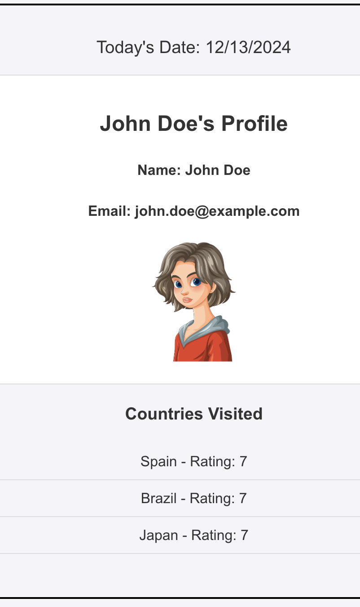

# React - Props & Conditional Rendering

## Requirements:

-   You must use `TypeScript`.

-   You can use `cra` / `vite` to create a React App.
    - (`vite` recommended)

-   You can use the given `CSS` or apply your own. (Optional)
    - `SCSS` is also optional 

-   Provide 1 commit per task.

-   You can choose your own file names

-   You can create `PRs` and send it to me in case you have some questions.

## Questions:

-   In this exercise you will create the following components:

    -   A main App component to render every other child component.

    -   A component to display today's Date. (Coming from App as `Props`)

    -   A component to display User's Profile Information. (Name, Email, Gender)

        -   It has 2 more components: 1 for `ProfileHeader` and 1 for `ProfileDetails`. (Coming from App as `Props`).

            -   Inside `ProfileDetails` you need to render Name and Email as `H4` tags and render an `img` which is conditionally showing an icon of male / female based on the gender. (You choose any image / icon)

        -   A component to display User's list of visited countries.

            ```js
            const countriesVisited: { name: string, rating: number }[] = [
            	{ name: "Spain", rating: 7 },
            	{ name: "Brazil", rating: 7 },
            	{ name: "Japan", rating: 7 },
            ];
            ```

## Below is an example of the UI, feel free to come up with your own design:



### Good Luck! 👍🏻
